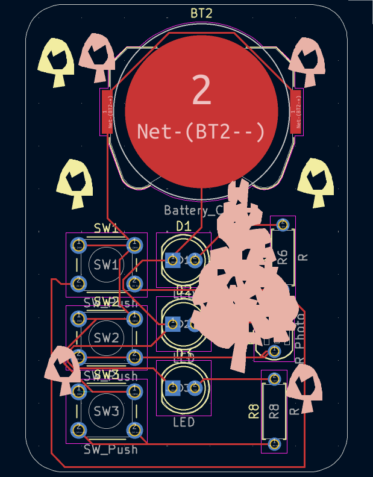

# solder_PCB

## Description
This project is a simple PCB circuit designed in **KiCad** where 3 LEDs are controlled individually — 3 by push buttons, and 1 by a **light-dependent resistor (LDR)** instead of a regular resistor. The LDR allows the LED to light up automatically in the dark, acting like a simple light sensor.
---

## 🧰 Bill of Materials (BOM)

| Component        | Quantity | Description                        |
|------------------|----------|------------------------------------|
| Resistor (220Ω)  | 2        | For current limiting (LEDs)        |
| LDR              | 1        | Replaces 1 resistor for light control |
| LED              | 3        | Any color                          |
| Push Button      | 2        | THT push button                    |
| Battery Holder   | 1        | For 9V or coin cell                |
| Battery          | 1        | 9V or CR2032                       |
| PCB              | 1        | Designed in KiCad                  |

---

## Screenshots

### Schematic  

### PCB Layout  

### 3D View  

---

## ⚙️ How it Works

- **LED 1**: Controlled by push button 1  
- **LED 2**:  Controlled by **LDR** — it lights up in darkness!
- **LED 3**: Controlled by push button 2 

This makes it not only a manual control circuit but also a **light-reactive system**.

---

## 💬 Slack Username
`@Mohamed Assem`

